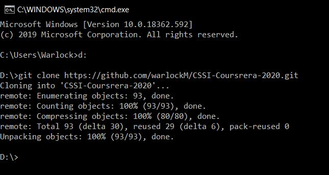
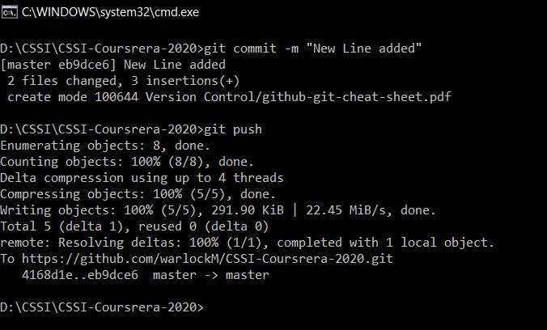
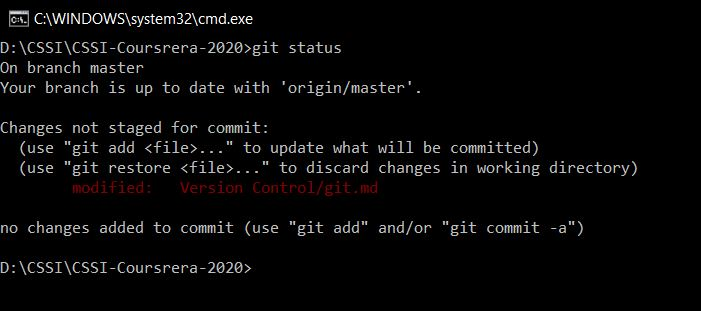
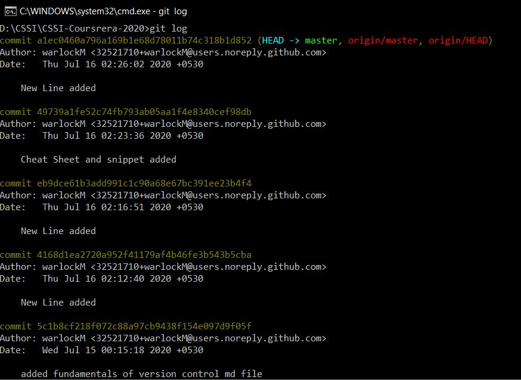

What and why of version control?
---------------------------------

It is a mechanism to control different versions of a applications and 
keep the codes that run on production safe from that of the ones
under development vresion.

Seperate copies of the code are maintained at any given point of time for a particular application.
Version controlling allows multiple to have their own local copy of the repository on their devices.
This allows them to collaborate and work on new features without affecting the the actual application
running in production environment.

To understand better, we can say that version control helps us to take the snapshot of our current 
progress in a development environment.

The most popular version controlling tool in GIT about which we will be discussing here.

How to get version controlling tools to work on your local devices?
--------------------------------------------------------------------

For linux users:
-----------------
1. Via binary files from the package manager.
2. For Debian OS:
	>`sudo apt install git-all`
3. For RPM based Distro:
	>`sudo dnf install git-all`
	
For Windows Users:
------------------
	Just go to https://git-scm.com/download/win and the download will start automatically.
	
For MAC users:
---------------
	Just go to https://git-scm.com/download/mac and the download will start automatically.
	
How does version control work?
-------------------------------
It is based on Distributed graph theory tree model. It connects multiple colloborators to a project.
The image below best describes how to get ready to use git.

Git command for beginners!
---------------------------
>`git clone url`

This command creates a local copy of git repository on your system.

>`git add filename.extension`

>git commit -m "Some message assosiated with the changes made"

This command saves the changes made in local copy of repository.

>`git push`
**no parameter needed for working within cloned git folders**

This command sends all updated data including files and folders from local copy of repository 
to the master branch.

>`git status`

This command shows the current repository we are working with and have recently commited to.`

>`git log`

This command shows the list commits done previously from local copy

Branches in `GIT`
-----------------
Branch can simply be understood as extension to the master branch whose code is used in production.
Any change made to a branch other that master branch doesn't affect the performance or functionality
of the application in master branch.

Branches are created for purposes like debugging, improvising or adding new features to an existing application
which is already released. It helps the developers/ collaborators to keep the application up and running while working on different
features of the application.

Difference between `GIT` and `GitHub`
-----------------------------------
`Git` is a revision control system, a tool to manage your source code history.

`GitHub` is a hosting service for Git repositories.

So they are not the same thing: `Git` is the tool, `GitHub` is the service for projects that use Git.

